# Grill-Me + Debrief — Implementation Roadmap

**Date**: 2026-04-14
**Goal**: add a traceable specification-first workflow so `claude-swarm` does not jump from vague intent to implementation and produce dark code.
**Why now**: current flows are strong at building, but still too eager to move from issue/topic to `/ck:plan` and `/ck:cook` with too little recorded reasoning.
**Core rule**: no important build without a written spec trace before it, and no important completion without a debrief trace after it.
**Temporary scope**: `grill-me` replaces `ck:brainstorm` in builder/manual planning flows first. Watcher keeps its current clarify loop until poll-safe state exists for already-grilled issues.

---

## Problem

There is a real risk of **Dark Factory -> Dark Code**:

```text
spec is vague
  -> agent plans too early
  -> agent builds code that mostly passes tests
  -> humans trust the tests
  -> later, nobody can explain the path, assumptions, or trade-offs
```

That is not acceptable for an engineering workflow.

Tests are necessary, but they are not enough.
The human engineer remains responsible for:

- what the code does
- why this design was chosen
- what was explicitly deferred
- what risks remain

So `claude-swarm` should optimize for **traceable engineering**, not just autonomous output.

---

## Three Blocks

The workflow should be organized into 3 explicit blocks:

```text
1. specifications
   clarify intent
   challenge assumptions
   record decisions
   produce a spec artifact

2. building
   plan
   cook
   test
   review

3. evaluation
   compare built vs spec/plan
   record gaps, surprises, deferrals
   produce follow-up tasks
```

Current state:

- `building` is strong and already handled well by `claude-swarm`
- `evaluation` exists partially via review, verify, journal, retro
- `specifications` is still too thin in many flows

Target state:

```text
grill-me -> spec trace -> /ck:plan -> /ck:cook -> review/test -> debrief
```

---

## Product Decision

We should add a small, strict **`grill-me` clarification stage** before final planning, and a structured **debrief stage** after implementation.

### What `grill-me` is

`grill-me` is not a general brainstorm.

It should be a focused spec-interview skill that:

- asks sharp clarification questions
- forces hidden assumptions into the open
- proposes decisions branch by branch
- requires explicit agreement/disagreement on important points
- writes a compact artifact humans can review later

### What `debrief` is

`debrief` is not a journal summary.

It should compare:

- requested scope
- clarified spec
- generated plan
- built result

And record:

- what matched
- what changed
- what was deferred
- what follow-up tasks now exist

---

## Architecture

```mermaid
flowchart LR
    A("Issue or Topic or Request") --> B("Grill-Me")
    B --> C("Spec Artifact")
    C --> D("ck:plan")
    D --> E("Plan Artifact")
    E --> F("ck:cook")
    F --> G("Test Review Verify")
    G --> H("Debrief")
    H --> I("Debrief Artifact")
    I --> J("Follow-up Tasks and Docs")

    style B fill:#7c3aed,stroke:#333,color:#fff
    style C fill:#1d4ed8,stroke:#333,color:#fff
    style H fill:#0f766e,stroke:#333,color:#fff
    style I fill:#14532d,stroke:#333,color:#fff
```



---

## Design Rules

### Rule 1: No direct jump from vague request to final plan

For medium/large work, `claude-swarm` should not go directly from:

```text
issue/topic -> /ck:plan --fast
```

It should go through:

```text
issue/topic -> grill-me -> spec artifact -> /ck:plan
```

### Rule 2: Spec trace must be human-readable

The output must live in project docs or plans, not only transient model output.

Minimum fields:

- problem
- in-scope
- out-of-scope
- decisions made
- decisions deferred
- risks / unknowns
- acceptance criteria

### Rule 3: Tests do not replace understanding

Passing tests can confirm behavior, but do not replace recorded reasoning.

### Rule 4: Debrief is required for non-trivial work

If a task generated a plan or roadmap, it should also generate a debrief.

### Rule 5: Keep advisor/executor split

Specification and high-level reasoning should prefer stronger advisor behavior.
Implementation should stay cost-effective.

Recommended routing:

| Step | Model | Why |
|---|---|---|
| grill-me | opus | challenge assumptions, ask better questions |
| plan | opus | architecture + sequencing |
| cook | sonnet | execution |
| debrief | sonnet or opus | compare artifacts, extract follow-ups |

---

## Current Gaps

Concrete gaps in current repo behavior:

| Area | Current | Gap |
|---|---|---|
| Watch clarify flow | `executeClarifyPhase()` already blocks unclear issues with GitHub comment + label loop | keep unchanged for now; poll-safe state needed before `grill-me` can replace it |
| Build generate | `brainstorm -> /ck:plan --hard -> /ck:scenario` | no explicit clarification interview artifact |
| Build run | `plan? -> cook -> commit -> final push` | no per-task debrief and no per-task test/review artifact to compare against |
| Docs | roadmap + CLI docs exist | no documented spec-first workflow |
| Skills | `clarify`, `ck:brainstorm`, `ck:plan`, `ck:cook` exist | no dedicated `grill-me` skill in repo and no merge plan with `clarifier.ts` |

---

## Phase G1 — Add `grill-me` Skill

**Goal**: create a small clarification-first skill for specification work before `/ck:plan`.

| # | Task | Status |
|---|---|---|
| 1 | Add repo-local skill at `.claude/skills/grill-me/SKILL.md` | Pending |
| 2 | Define behavior: ask 8-15 sharp questions, not open-ended rambling | Pending |
| 3 | Keep explicit agree/disagree decision pattern for major choices | Pending |
| 4 | Output a compact spec summary artifact, not just chat text | Pending |
| 5 | Include sections: problem, scope, non-goals, decisions, risks, acceptance criteria | Pending |
| 6 | Include stop condition: only hand off to `/ck:plan` once critical ambiguities are resolved | Pending |

**Implementation notes**:

- Keep this skill small and opinionated.
- Do not overload `ck:brainstorm` with two jobs.
- `grill-me` should be the spec gate; `brainstorm` remains wider exploration.

---

## Phase G2 — Add Spec Artifact Writer

**Goal**: persist the result of `grill-me` in a durable artifact humans can inspect later.

| # | Task | Status |
|---|---|---|
| 7 | Define artifact format for clarified specs | Pending |
| 8 | Choose one source of truth for spec traces: `plans/<plan-dir>/spec.md` for plan-driven work, watcher comment thread only as input, not final storage | Pending |
| 9 | Add frontmatter: date, source issue/topic, model, status, reviewed-by-human | Pending |
| 10 | Record explicit accepted and rejected options | Pending |
| 11 | Record deferred follow-up questions without blocking the rest | Pending |

**Recommended artifact shape**:

```text
Summary
Scope
Non-goals
Decision log
Open questions
Acceptance criteria
```

**Storage rule**:

- plan/build workflows: `plans/<plan-dir>/spec.md`
- watcher-only follow-up traces: mirror final summary into `obsidian-vault/Review/Runs/` or another existing vault trace path, not random new docs files

Prefer one durable source per workflow. Avoid splitting traceability across `docs/`, `plans/`, and vault notes for the same task.

---

## Phase G3 — Integrate `grill-me` Before Planning

**Goal**: wire the spec stage into the places that currently jump too early to planning.

| # | Task | Status |
|---|---|---|
| 12 | Upgrade `src/commands/build/roadmap-generator.ts` from `brainstorm -> plan -> scenario` to `grill-me -> plan -> scenario`, or `brainstorm -> grill-me -> plan -> scenario` if broad exploration still adds value | Pending |
| 13 | Decide whether `brainstorm` remains optional before `grill-me` for broad exploration | Pending |
| 14 | Cover all builder/manual roadmap generation entrypoints: `roadmap-generator.ts`, `generate-doc.ts`, and `from-scratch-pipeline.ts` | Pending |
| 15 | Add threshold rules: trivial fixes can skip `grill-me`; medium/large features cannot | Pending |
| 16 | Pass spec artifact path or spec summary into `/ck:plan` prompt | Pending |
| 17 | Update prompt builders so `/ck:plan` consumes clarified scope, decisions, and acceptance criteria | Pending |
| 18 | Defer watcher integration until poll-safe state exists for already-grilled issues | Deferred |

**Recommended flow changes**:

### Watch flow target

```text
issue
  -> existing clarify gate
  -> /ck:plan
  -> /ck:cook
```

### Build generate target

```text
build generate
  -> grill-me
  -> /ck:plan --hard
  -> /ck:scenario
```

### Why not use brainstorm for this?

Because `brainstorm` explores options.
`grill-me` should force decisions and surface missing information.

Temporary rollout note:

- builder/manual flows: `grill-me` replaces `ck:brainstorm` as the default pre-plan step
- watcher flows: keep current clarify behavior unchanged for now
- future watcher rollout needs a durable marker for `already-grilled` or equivalent poll-safe state

---

## Phase G4 — Add Debrief Skill / Step

**Goal**: create a structured post-build comparison step so the team can understand what happened and what remains.

| # | Task | Status |
|---|---|---|
| 18 | Add repo-local skill at `.claude/skills/debrief/SKILL.md` or equivalent debrief prompt template | Pending |
| 19 | Compare built result against spec artifact and plan artifact | Pending |
| 20 | Record mismatches, deferrals, surprises, and risks | Pending |
| 21 | Extract follow-up tasks that were discovered during implementation | Pending |
| 22 | Produce a concise debrief artifact for humans | Pending |

**Debrief questions should cover**:

- Did we build what we said we would build?
- Which decisions changed during implementation?
- Which edge cases appeared only during coding/testing?
- What was intentionally deferred?
- What should become the next task or issue?

---

## Phase G5 — Wire Debrief Into Builder + Watcher

**Goal**: make debrief a standard end step after implementation, review, and evaluation.

| # | Task | Status |
|---|---|---|
| 23 | Add debrief step after successful roadmap task execution in `src/commands/build/epic-executor.ts` | Pending |
| 24 | Decide builder prerequisite: add per-task test/review evidence first, or make debrief explicitly compare only spec/plan/cook/commit for v1 | Pending |
| 25 | Insert watcher debrief inside `post-ship-runner.ts` before journal/run-recorder/knowledge extraction so downstream traces can consume it | Pending |
| 26 | Feed debrief output into journal / run-recorder / knowledge extraction / follow-up issue creation | Pending |
| 27 | Move or mirror debrief outside the `--vault` gate if it becomes required for official completion | Pending |
| 28 | Record debrief artifact path in console/report output | Pending |

**Builder target flow**:

```text
/ck:plan
  -> /ck:cook
  -> test/review/commit
  -> debrief
  -> follow-up tasks / docs update
```

**Watcher target flow**:

```text
test-flow
  -> scout/predict/ship/design/slack
  -> debrief
  -> journal
  -> run-recorder
  -> knowledge extraction
```

Note: current watcher post-ship order is `test-flow -> security? -> scout -> predict? -> ship -> design-review -> slack -> journal -> llms -> run-recorder -> knowledge extraction`. Debrief should hook before journal/run-recorder if those artifacts must include it.

---

## Phase G6 — CLI + UX Surface

**Goal**: make the new workflow visible and easy to use.

| # | Task | Status |
|---|---|---|
| 28 | Add `claude-swarm grill-me <topic>` command, or expose it clearly through existing slash-command runner | Pending |
| 29 | Add debrief command or post-run helper for manual use | Pending |
| 30 | Update `src/index.ts` if a new CLI command is added | Pending |
| 31 | Update `docs/cli-usage-guide.md` with new commands and examples | Pending |
| 32 | Update `README.md` workflow diagram to show specifications/building/evaluation | Pending |

**CLI examples**:

```bash
# Clarify before planning
claude-swarm grill-me "Upgrade claude-swarm to add specification and debrief stages"

# Generate roadmap with clarification first
claude-swarm build generate "Upgrade planning workflow" --context @docs/current-process.md

# Run manual debrief after a roadmap phase
claude-swarm debrief --roadmap @docs/implement-roadmap-x.md --phase 2
```

---

## Phase G7 — Completion Policy

**Goal**: make traces part of the workflow contract, not optional nice-to-have notes.

| # | Task | Status |
|---|---|---|
| 33 | Define when `grill-me` is required vs skippable | Pending |
| 34 | Define when debrief is required vs best-effort | Pending |
| 35 | Prevent “done” status if non-trivial work lacks spec trace or debrief trace | Pending |
| 36 | Decide how this policy works in watcher runs without `--vault` | Pending |
| 37 | Keep lightweight escape hatch for tiny fixes | Pending |

**Recommended policy**:

```text
tiny fix:
  grill-me optional
  debrief optional

feature / roadmap / architectural change:
  grill-me required
  debrief required
```

---

## File Impact

Primary files likely affected:

| Area | Files |
|---|---|
| New skills | `.claude/skills/grill-me/SKILL.md`, `.claude/skills/debrief/SKILL.md` |
| Watch flow | `src/commands/watch/phases/post-ship-runner.ts` |
| Watch phase plumbing | optional later: `src/commands/watch/types.ts`, `src/commands/watch/phases/model-router.ts`, `src/commands/watch/watch-command.ts` |
| Build generate | `src/commands/build/roadmap-generator.ts`, `src/commands/build/generate-doc.ts`, `src/commands/build/from-scratch-pipeline.ts` |
| Build run | `src/commands/build/epic-executor.ts` |
| CLI | `src/index.ts`, possible new `src/cli/grill-me.ts`, possible new `src/cli/debrief.ts` |
| Docs | `README.md`, `docs/cli-usage-guide.md`, this roadmap |

---

## Proposed End State

```text
SPECIFICATIONS
  grill-me
  -> spec.md

BUILDING
  /ck:plan
  -> plan.md / phase files
  -> /ck:cook
  -> tests / review / verify

EVALUATION
  debrief
  -> debrief.md
  -> follow-up tasks
```

This gives the team:

- traceable path before coding
- lower risk of dark code
- clearer human responsibility
- better follow-up discovery after implementation

---

## Implementation Order

Recommended order:

1. G1 `grill-me` skill
2. G2 spec artifact writer
3. G3 pre-plan integration in builder/manual flows
4. G4 debrief skill/template
5. G5 debrief integration in builder + watcher
6. G6 CLI/docs updates
7. G7 completion policy enforcement

---

## Summary

| Phase | What | Files | Tasks | Status |
|---|---|---|---|---|
| G1 | Add `grill-me` skill | `.claude/skills/grill-me/SKILL.md` | 6 | Pending |
| G2 | Persist clarified spec artifact | `plans/*/spec.md` or `docs/spec-*.md` | 5 | Pending |
| G3 | Wire `grill-me` before plan | builder/manual roadmap generation entrypoints | 7 | Pending |
| G4 | Add debrief skill/step | `.claude/skills/debrief/SKILL.md` | 5 | Pending |
| G5 | Wire debrief after build | `epic-executor.ts`, `post-ship-runner.ts`, trace writers | 6 | Pending |
| G6 | CLI + docs surface | `src/index.ts`, `docs/cli-usage-guide.md`, `README.md` | 5 | Pending |
| G7 | Completion policy enforcement | workflow guards + prompts | 5 | Pending |
| **Total** | **Specification-first + debrief workflow** | **8+ files now, watcher expansion later** | **39** | **0 Complete, 7 Pending** |

---

## Unresolved Questions

1. Should `grill-me` exist as a new dedicated CLI command, or only as a repo-local skill invoked inside other flows?
2. When watcher integration is revisited, should automation block on missing human answers, or generate a provisional spec and require later approval?
3. Should debrief always write a file, or can tiny tasks attach it only to run history?
4. Should `brainstorm` stay before `grill-me` in `build generate`, or should `grill-me` fully replace it for roadmap generation?
5. For watcher runs without `--vault`, do we allow “best-effort only” debrief, or do we make vault-backed traces mandatory for official completion?
6. What is the right poll-safe marker for future watcher rollout: issue label, bot marker comment, plan artifact path, or run-state file?
