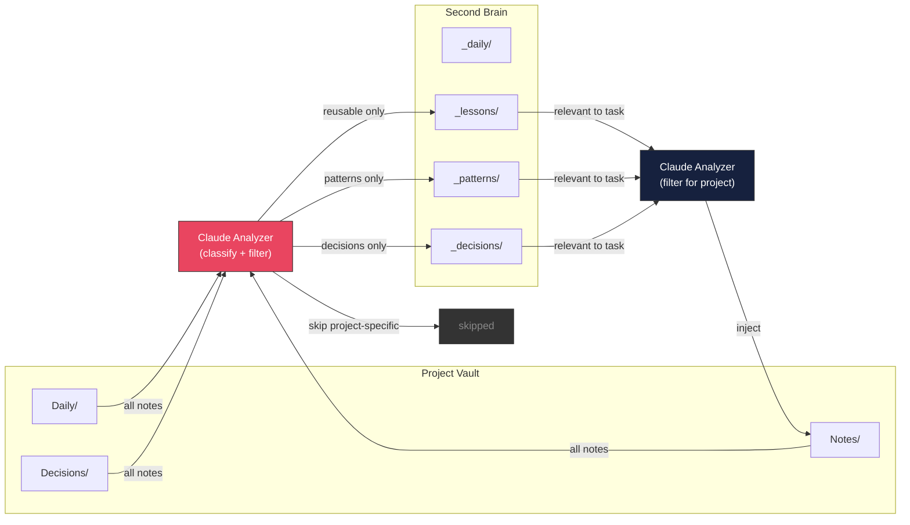

# Smart Vault Sync — Implementation Roadmap

**Date**: 2026-04-06
**Goal**: AI-powered knowledge sync between project vaults and second-brain
**Location**: `src/commands/sync/` inside claude-swarm repo + `second-brain/` scripts

---

## Problem

Dumb copy syncs everything — noise, project-specific fixes, irrelevant notes.
Smart sync uses Claude to classify, filter, and align knowledge before syncing.

```
DUMB (current):  cp *.md → second-brain/     (everything, no filter)
SMART (target):  Claude reads → classifies → promotes only reusable → second-brain/
                 Claude reads second-brain → filters relevant → injects into project
```

---

## Architecture



---

## Concept Comparison

**Rule**: copy the memory architecture idea, not the Python codebase.

We should reuse the concept from `claude-memory-compiler`:

```text
capture -> compile -> index -> retrieve -> reinject
```

We should NOT port its Python scripts 1:1 into this repo. `claude-swarm` should implement the same loop in Node.js and fit the existing watcher + builder flows.

### Side-by-side

```text
+---------------------------+----------------------------------+-------------------------------------------+
| Area                      | Author already did               | What claude-swarm should do next          |
+---------------------------+----------------------------------+-------------------------------------------+
| Capture                   | SessionEnd / PreCompact hooks    | Add local Node.js hooks                   |
| Raw memory                | transcript -> daily logs         | Save raw session notes / raw logs         |
| Curation                  | compile.py builds knowledge      | Build Node.js note classifier + compiler  |
| Knowledge structure       | concepts / connections / qa      | lessons / patterns / decisions            |
| Retrieval                 | index-guided retrieval           | Curated index + better ranking            |
| Reinjection               | SessionStart injects context     | Inject before /ck:plan and roadmap cook   |
| Quality control           | lint / stale / contradiction     | Add alignment / lint later                |
| Stack                     | Python                           | Node.js only for implementation           |
+---------------------------+----------------------------------+-------------------------------------------+
```

### Current vs Future

```text
AUTHOR: claude-memory-compiler
--------------------------------------------
Claude session
  -> hooks capture transcript
  -> raw daily logs
  -> compiler reads logs
  -> structured knowledge articles
  -> index.md
  -> session-start injects index
  -> next session uses memory


OURS: claude-swarm today
--------------------------------------------
GitHub issue / roadmap task
  -> watcher flow or builder flow
  -> post-ship journal-writer
  -> Notes/ lessons
  -> vault-context-loader
  -> next /ck:plan gets basic vault context

Gap:
  - no raw session capture pipeline
  - no compiled knowledge index
  - retrieval is still simple keyword scoring
  - roadmap-loader path has no reminder/record step after cook succeeds


OURS: claude-swarm target
--------------------------------------------
Issue / task / session
  -> local Node.js hooks capture raw notes
  -> Raw/
  -> classifier promotes reusable knowledge
  -> Knowledge/
     -> index.md
     -> Lessons/
     -> Patterns/
     -> Decisions/
  -> retrieval picks relevant notes
  -> /ck:plan and builder get better context
  -> journal / record / promote loop repeats
```

### Node.js-first implementation rule

```text
COPY THE IDEA
-------------
capture -> compile -> index -> retrieve -> reinject

DO NOT COPY
-----------
python scripts
repo structure 1:1
exact hooks implementation
exact file names
exact article taxonomy
```

---

## Phase 1 — Note Classifier

**Goal**: Claude reads a note and classifies: promote / skip / project-specific.

| # | Task | Status |
|---|---|---|
| 1 | Create `src/commands/sync/note-classifier.ts` | Pending |
| 2 | Spawn Claude (haiku, low effort) to classify each note | Pending |
| 3 | Classification output: `{ action: "promote" \| "skip", reason, category }` | Pending |
| 4 | Categories: lesson, pattern, decision, foundation, project-specific | Pending |
| 5 | Use `--json-schema` for structured classification output | Pending |
| 6 | Batch mode: classify multiple notes in one call (save tokens) | Pending |

**Classification prompt**:
```
Read this note. Classify:
- "promote" if reusable across projects (patterns, standards, conventions, 
  foundation knowledge like framework setup, library configs, code standards)
- "skip" if project-specific (bug fix for one issue, PR-specific context, 
  temporary state)

Output JSON: { action, reason, category }
```

**Model**: haiku (cheap, classification is simple)

---

## Phase 2 — Smart Pull (Project → Second Brain)

**Goal**: Only promote reusable notes, skip project-specific ones.

| # | Task | Status |
|---|---|---|
| 7 | Create `src/commands/sync/smart-pull.ts` | Pending |
| 8 | Read all notes from project vault (Daily/, Notes/, Decisions/) | Pending |
| 9 | Skip notes already in second-brain (by filename) | Pending |
| 10 | Classify new notes via note-classifier | Pending |
| 11 | Copy "promote" notes to correct second-brain folder | Pending |
| 12 | Log skipped notes with reason | Pending |
| 13 | Add frontmatter to promoted notes: `source-project`, `promoted-date` | Pending |
| 14 | Dry-run mode: show what would be promoted without copying | Pending |

**Flow**:
```
smart-pull:
  1. Scan project vault for new .md files
  2. Filter out already-synced (by filename match)
  3. Batch classify remaining via Claude (haiku)
  4. Copy "promote" → second-brain/{category}/
  5. Log "skip" with reason
  6. Add frontmatter: source, date, category
```

---

## Phase 3 — Smart Push (Second Brain → Project)

**Goal**: Inject only relevant knowledge when starting new work on a project.

| # | Task | Status |
|---|---|---|
| 15 | Create `src/commands/sync/smart-push.ts` | Pending |
| 16 | Accept context: issue title, feature description, or task spec | Pending |
| 17 | Read all second-brain notes (_lessons/, _patterns/, _decisions/) | Pending |
| 18 | Classify relevance to the given context via Claude (sonnet) | Pending |
| 19 | Copy relevant notes to project vault Notes/ | Pending |
| 20 | Skip notes already in project vault | Pending |
| 21 | Add frontmatter: `injected-from: second-brain`, `injected-for: "issue #42"` | Pending |
| 22 | Dry-run mode | Pending |

**Flow**:
```
smart-push --project medusa --context "Add analytics dashboard to Vue admin":
  1. Read all second-brain _lessons/ _patterns/ _decisions/
  2. Claude classifies relevance to "analytics dashboard + Vue admin"
     - chart-js-config-pattern.md → RELEVANT (chart library)
     - vue-3-component-structure.md → RELEVANT (Vue patterns)
     - dotnet-api-conventions.md → RELEVANT (backend standards)
     - medusa-v2-migration.md → NOT RELEVANT
     - ck-ship-fallback.md → NOT RELEVANT
  3. Copy relevant notes to medusa/obsidian-vault/Notes/
  4. vault-context-loader reads these during /ck:plan
```

---

## Phase 4 — Alignment Check

**Goal**: Detect conflicts between project vault notes and second-brain notes.

| # | Task | Status |
|---|---|---|
| 23 | Create `src/commands/sync/alignment-checker.ts` | Pending |
| 24 | Compare same-named notes across vaults for drift | Pending |
| 25 | Claude detects: outdated, contradicting, superseded notes | Pending |
| 26 | Report: which notes need updating and which direction | Pending |
| 27 | Auto-update option: newer version wins (with backup) | Pending |

**Example**:
```
alignment-check:
  second-brain/_lessons/chart-js-config-pattern.md  (v2, updated 2026-04-01)
  medusa/obsidian-vault/Notes/chart-js-config-pattern.md  (v1, from 2026-03-15)

  Result: medusa version is OUTDATED. Recommend: sync from second-brain.
```

---

## Phase 5 — CLI Wiring

**Goal**: Wire into `claude-swarm sync` subcommand.

| # | Task | Status |
|---|---|---|
| 28 | Add `sync` command to CLI (commander.js) | Pending |
| 29 | `claude-swarm sync pull` → smart-pull from all projects | Pending |
| 30 | `claude-swarm sync pull --project medusa` → one project | Pending |
| 31 | `claude-swarm sync push --project medusa --context "task"` → smart-push | Pending |
| 32 | `claude-swarm sync check` → alignment check all vaults | Pending |
| 33 | `claude-swarm sync check --project medusa` → one project | Pending |
| 34 | `--dry-run` on all subcommands | Pending |
| 35 | `--force` to skip classification (dumb copy, fallback) | Pending |

---

## Phase 6 — Loop Prevention (Safety)

**Goal**: Prevent infinite sync loops between vaults.

| # | Task | Status |
|---|---|---|
| 36 | Add `source-project` frontmatter to promoted notes (smart-pull skips on re-pull) | Pending |
| 37 | Add `injected-from: second-brain` frontmatter to injected notes (smart-pull skips these) | Pending |
| 38 | Enforce one-shot rule: pull and push NEVER chain in same cycle | Pending |
| 39 | Add `synced-at` timestamp to prevent re-processing same note | Pending |

**3 rules that prevent infinite loops**:
```
Rule 1: NEVER chain pull → push in same cycle
  Pull happens AFTER issue completion
  Push happens BEFORE next issue planning
  They never trigger each other

Rule 2: Skip notes with injected-from frontmatter
  Notes pushed FROM second-brain have:
    ---
    injected-from: second-brain
    ---
  Smart-pull sees this → SKIP (don't promote back)

Rule 3: Skip notes with source-project frontmatter
  Notes pulled FROM projects have:
    ---
    source-project: medusa
    promoted-date: 2026-04-06
    ---
  Smart-push sees this → already synced, SKIP
```

---

## Phase 7 — Watcher Integration

**Goal**: Auto-sync after watcher completes issues. One-shot per cycle.

| # | Task | Status |
|---|---|---|
| 40 | After journal-writer runs → trigger smart-pull ONCE | Pending |
| 41 | Before /ck:plan runs → trigger smart-push ONCE with issue context | Pending |
| 42 | Wire into post-ship-runner.ts (after journal, before next poll) | Pending |
| 43 | Respect loop-prevention rules from Phase 6 | Pending |

**Watcher flow with smart sync**:
```
poll → classify → route → execute → commit
  → GREEN test → RED test → /ck:ship
  → slack-report → journal-writer
  → SMART PULL ONCE (new notes → second-brain)
  → STOP. No more sync this cycle.
  
next poll cycle:
  → SMART PUSH ONCE (relevant notes → project vault)
  → /ck:plan (now has context from second-brain)
  → execute → commit → ...
```

---

## Phase 8 — Builder Integration

**Goal**: Builder gets smart sync and memory capture, especially in roadmap-loader execution via `executeFromRoadmap()` in `src/commands/build/epic-executor.ts`.

| # | Task | Status |
|---|---|---|
| 44 | `build generate`: smart-push before brainstorm (inject context) | Pending |
| 45 | `build run`: smart-push before each issue's /ck:plan | Pending |
| 46 | `build run`: smart-pull after each issue completes | Pending |
| 47 | `build run --roadmap`: add reminder/record step after successful `/ck:cook` in `executeFromRoadmap()` before commit | Pending |
| 48 | `build run --roadmap`: write run summary / lesson candidate for roadmap tasks (roadmap loader has no post-ship journal today) | Pending |
| 49 | `build from-scratch`: smart-push at start, smart-pull at end | Pending |
| 50 | Respect same loop-prevention rules from Phase 6 | Pending |

**Builder flow with smart sync**:
```
build generate "Add analytics dashboard"
  → SMART PUSH (inject chart-js, vue patterns from second-brain)
  → /ck:brainstorm (now has foundation knowledge)
  → generates roadmap with standards already applied

build run --epic 1 --auto
  → for each issue:
    → SMART PUSH (inject relevant notes for THIS issue)
    → /ck:plan (knows team conventions)
    → /ck:cook (follows standards)
    → builder reminder / record step
    → /ck:test
    → /ck:ship
    → SMART PULL (promote new lessons)

build run --roadmap @docs/implement-roadmap-x.md
  → executeFromRoadmap()
  → for each roadmap task:
    → SMART PUSH (inject relevant notes for THIS task)
    → /ck:cook
    → roadmap reminder / record step
    → /ck:git cm
    → SMART PULL
```

**Current roadmap-loader gap to fix**:

```text
watcher today
  execute
  -> slack-report
  -> journal-writer
  -> run-recorder

roadmap loader today (`executeFromRoadmap()`)
  execute
  -> /ck:cook
  -> /ck:git cm
  -> optional checklist sync

Missing in roadmap loader:
  - no reminder to capture reusable lesson after cook
  - no structured run record for roadmap tasks
  - no journal-style memory artifact at the end
```

---

## CLI Reference

```bash
# Smart pull: project vaults → second-brain (classify + promote)
claude-swarm sync pull
claude-swarm sync pull --project medusa
claude-swarm sync pull --dry-run

# Smart push: second-brain → project vault (filter by context)
claude-swarm sync push --project medusa --context "Add analytics dashboard"
claude-swarm sync push --project medusa --context @issue-42.md
claude-swarm sync push --dry-run

# Alignment check: detect drift between vaults
claude-swarm sync check
claude-swarm sync check --project medusa

# Dumb copy fallback (no Claude, just copy)
claude-swarm sync pull --force
claude-swarm sync push --project medusa --force
```

---

## Model Routing

| Step | Model | Effort | Why |
|---|---|---|---|
| Note classification (pull) | haiku | low | Simple classify: promote/skip |
| Relevance filtering (push) | sonnet | medium | Needs context understanding |
| Alignment check | sonnet | low | Compare two versions |

---

## Summary

| Phase | What | Files | Tasks |
|---|---|---|---|
| 1 | Note Classifier | `note-classifier.ts` | 6 |
| 2 | Smart Pull (project → brain) | `smart-pull.ts` | 8 |
| 3 | Smart Push (brain → project) | `smart-push.ts` | 8 |
| 4 | Alignment Check | `alignment-checker.ts` | 5 |
| 5 | CLI Wiring | `sync-command.ts` | 8 |
| 6 | Loop Prevention (safety) | frontmatter rules in pull/push | 4 |
| 7 | Watcher Integration (auto) | `post-ship-runner.ts` | 4 |
| 8 | Builder Integration + Roadmap Loader Memory Capture | `src/commands/build/epic-executor.ts` | 7 |
| **Total** | | **5 new + 2 upgraded** | **50 tasks** |
