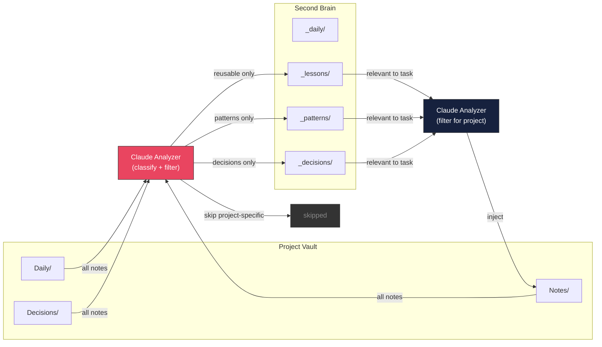

# Smart Vault Sync — Implementation Roadmap

**Date**: 2026-04-06
**Goal**: AI-powered knowledge sync between project vaults and second-brain
**Location**: `src/commands/sync/` inside claude-swarm repo + `second-brain/` scripts

---

## Problem

Dumb copy syncs everything — noise, project-specific fixes, irrelevant notes.
Smart sync uses Claude to classify, filter, and align knowledge before syncing.

```
DUMB (current):  cp *.md → second-brain/     (everything, no filter)
SMART (target):  Claude reads → classifies → promotes only reusable → second-brain/
                 Claude reads second-brain → filters relevant → injects into project
```

---

## Architecture



---

## Phase 1 — Note Classifier

**Goal**: Claude reads a note and classifies: promote / skip / project-specific.

| # | Task | Status |
|---|---|---|
| 1 | Create `src/commands/sync/note-classifier.ts` | Pending |
| 2 | Spawn Claude (haiku, low effort) to classify each note | Pending |
| 3 | Classification output: `{ action: "promote" \| "skip", reason, category }` | Pending |
| 4 | Categories: lesson, pattern, decision, foundation, project-specific | Pending |
| 5 | Use `--json-schema` for structured classification output | Pending |
| 6 | Batch mode: classify multiple notes in one call (save tokens) | Pending |

**Classification prompt**:
```
Read this note. Classify:
- "promote" if reusable across projects (patterns, standards, conventions, 
  foundation knowledge like framework setup, library configs, code standards)
- "skip" if project-specific (bug fix for one issue, PR-specific context, 
  temporary state)

Output JSON: { action, reason, category }
```

**Model**: haiku (cheap, classification is simple)

---

## Phase 2 — Smart Pull (Project → Second Brain)

**Goal**: Only promote reusable notes, skip project-specific ones.

| # | Task | Status |
|---|---|---|
| 7 | Create `src/commands/sync/smart-pull.ts` | Pending |
| 8 | Read all notes from project vault (Daily/, Notes/, Decisions/) | Pending |
| 9 | Skip notes already in second-brain (by filename) | Pending |
| 10 | Classify new notes via note-classifier | Pending |
| 11 | Copy "promote" notes to correct second-brain folder | Pending |
| 12 | Log skipped notes with reason | Pending |
| 13 | Add frontmatter to promoted notes: `source-project`, `promoted-date` | Pending |
| 14 | Dry-run mode: show what would be promoted without copying | Pending |

**Flow**:
```
smart-pull:
  1. Scan project vault for new .md files
  2. Filter out already-synced (by filename match)
  3. Batch classify remaining via Claude (haiku)
  4. Copy "promote" → second-brain/{category}/
  5. Log "skip" with reason
  6. Add frontmatter: source, date, category
```

---

## Phase 3 — Smart Push (Second Brain → Project)

**Goal**: Inject only relevant knowledge when starting new work on a project.

| # | Task | Status |
|---|---|---|
| 15 | Create `src/commands/sync/smart-push.ts` | Pending |
| 16 | Accept context: issue title, feature description, or task spec | Pending |
| 17 | Read all second-brain notes (_lessons/, _patterns/, _decisions/) | Pending |
| 18 | Classify relevance to the given context via Claude (sonnet) | Pending |
| 19 | Copy relevant notes to project vault Notes/ | Pending |
| 20 | Skip notes already in project vault | Pending |
| 21 | Add frontmatter: `injected-from: second-brain`, `injected-for: "issue #42"` | Pending |
| 22 | Dry-run mode | Pending |

**Flow**:
```
smart-push --project medusa --context "Add analytics dashboard to Vue admin":
  1. Read all second-brain _lessons/ _patterns/ _decisions/
  2. Claude classifies relevance to "analytics dashboard + Vue admin"
     - chart-js-config-pattern.md → RELEVANT (chart library)
     - vue-3-component-structure.md → RELEVANT (Vue patterns)
     - dotnet-api-conventions.md → RELEVANT (backend standards)
     - medusa-v2-migration.md → NOT RELEVANT
     - ck-ship-fallback.md → NOT RELEVANT
  3. Copy relevant notes to medusa/obsidian-vault/Notes/
  4. vault-context-loader reads these during /ck:plan
```

---

## Phase 4 — Alignment Check

**Goal**: Detect conflicts between project vault notes and second-brain notes.

| # | Task | Status |
|---|---|---|
| 23 | Create `src/commands/sync/alignment-checker.ts` | Pending |
| 24 | Compare same-named notes across vaults for drift | Pending |
| 25 | Claude detects: outdated, contradicting, superseded notes | Pending |
| 26 | Report: which notes need updating and which direction | Pending |
| 27 | Auto-update option: newer version wins (with backup) | Pending |

**Example**:
```
alignment-check:
  second-brain/_lessons/chart-js-config-pattern.md  (v2, updated 2026-04-01)
  medusa/obsidian-vault/Notes/chart-js-config-pattern.md  (v1, from 2026-03-15)

  Result: medusa version is OUTDATED. Recommend: sync from second-brain.
```

---

## Phase 5 — CLI Wiring

**Goal**: Wire into `claude-swarm sync` subcommand.

| # | Task | Status |
|---|---|---|
| 28 | Add `sync` command to CLI (commander.js) | Pending |
| 29 | `claude-swarm sync pull` → smart-pull from all projects | Pending |
| 30 | `claude-swarm sync pull --project medusa` → one project | Pending |
| 31 | `claude-swarm sync push --project medusa --context "task"` → smart-push | Pending |
| 32 | `claude-swarm sync check` → alignment check all vaults | Pending |
| 33 | `claude-swarm sync check --project medusa` → one project | Pending |
| 34 | `--dry-run` on all subcommands | Pending |
| 35 | `--force` to skip classification (dumb copy, fallback) | Pending |

---

## Phase 6 — Watcher Integration

**Goal**: Auto-sync after watcher completes issues.

| # | Task | Status |
|---|---|---|
| 36 | After journal-writer runs → trigger smart-pull for new notes | Pending |
| 37 | Before /ck:plan runs → trigger smart-push with issue context | Pending |
| 38 | Wire into post-ship-runner.ts (after journal, before next poll) | Pending |

**Watcher flow with smart sync**:
```
poll → classify → route → execute → commit
  → GREEN test → RED test → /ck:ship
  → slack-report → journal-writer
  → SMART PULL (new notes → second-brain)     ← NEW
  → next poll
  → SMART PUSH (relevant notes → project vault) ← NEW
  → /ck:plan (now has context from second-brain)
```

---

## CLI Reference

```bash
# Smart pull: project vaults → second-brain (classify + promote)
claude-swarm sync pull
claude-swarm sync pull --project medusa
claude-swarm sync pull --dry-run

# Smart push: second-brain → project vault (filter by context)
claude-swarm sync push --project medusa --context "Add analytics dashboard"
claude-swarm sync push --project medusa --context @issue-42.md
claude-swarm sync push --dry-run

# Alignment check: detect drift between vaults
claude-swarm sync check
claude-swarm sync check --project medusa

# Dumb copy fallback (no Claude, just copy)
claude-swarm sync pull --force
claude-swarm sync push --project medusa --force
```

---

## Model Routing

| Step | Model | Effort | Why |
|---|---|---|---|
| Note classification (pull) | haiku | low | Simple classify: promote/skip |
| Relevance filtering (push) | sonnet | medium | Needs context understanding |
| Alignment check | sonnet | low | Compare two versions |

---

## Summary

| Phase | What | Files | Tasks |
|---|---|---|---|
| 1 | Note Classifier | `note-classifier.ts` | 6 |
| 2 | Smart Pull | `smart-pull.ts` | 8 |
| 3 | Smart Push | `smart-push.ts` | 8 |
| 4 | Alignment Check | `alignment-checker.ts` | 5 |
| 5 | CLI Wiring | `sync-command.ts` | 8 |
| 6 | Watcher Integration | `post-ship-runner.ts` | 3 |
| **Total** | | **5 new files + 1 upgraded** | **38 tasks** |
